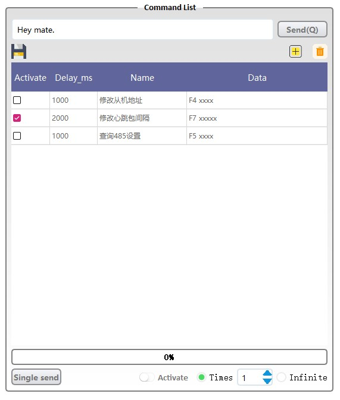

# MQTT_Assistant

This is a MQTT Assistant for testing.

# Code Version

Python 3.5 + PyQt5


# Python packet

1. paho-mqtt: 
    ```
    pip install paho-mqtt
    ```

2. PyQt5: 
    ```
    PyQt5: pip install pyqt5
    ```

3. PyQt5-tools: 
    ```
    pip install pyqt5-tools
    ```


# Tool

You can use `Interface/tool.py` to transform `.ui` to `.py`

# How to use

Use **JT_EMQ_Test_Assistant_Simple.py** to run the programme.

- ScreenShot

<center>
    
    <br>
    <div style="color:orange; border-bottom: 1px solid #d9d9d9;
    display: inline-block;
    padding: 2px;">Mainwindow</div>
</center>

### Top of the window:

<center>
    
    <br>
    <div style="color:orange; border-bottom: 1px solid #d9d9d9;
    display: inline-block;
    padding: 2px;">Top of the window</div>
</center>

When you click the `Connect to EMQ` button the setting of `EMQ Setting` information will be saved automatically.

### Left side:

<center>
    
    <br>
    <div style="color:orange; border-bottom: 1px solid #d9d9d9;
    display: inline-block;
    padding: 2px;">Left side</div>
</center>

When you want to **focus** on one line in `Text Edit` on the left of the window, just click it , it will stop sliding down , then click the button name `Final line` , it will keep show the latest data.

The software save log by default , if you do not want to save it , just unclick the `Save log` check box In the lower left corner of the window.

### Right side:

<center>
    
    <br>
    <div style="color:orange; border-bottom: 1px solid #d9d9d9;
    display: inline-block;
    padding: 2px;">Right_side</div>
</center>


You can send custom message by click the `Send` button (shortcut: `Alt + Q`).

You can `add` command in the table by click the nice  button(shortcut: `ctrl + A`) or `delete` by the  button (shortcut: `ctrl + D`) .

**REMEMBER** : After you edited the table you need to click the button  to save (shortcut: `ctrl + S`)!

You also can just **Right Click** in the table will show `Send` and `Delete` .

The Right click menu `Send` and button `Single send` do the same job -> send the command you just selected in the table .

If you want to send the command cyclically , you can just click the checkBox `Activate` the software will send command which is activated in column of the table name `Activate` then delay time is according to command row `Delay_ms` .

Number of times the instruction is sent cyclically according to the spinBox beside the checkBox name `Activate`. You also can choose infinite loop .